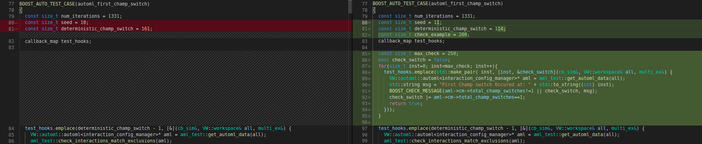
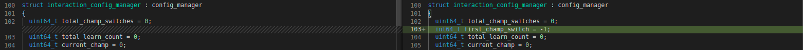
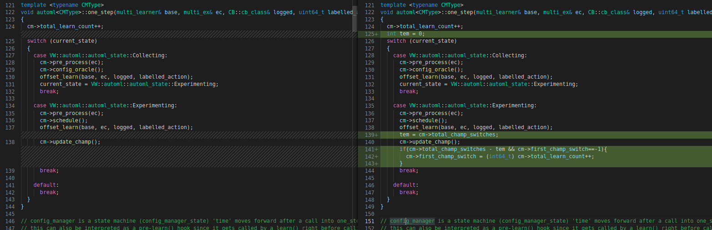
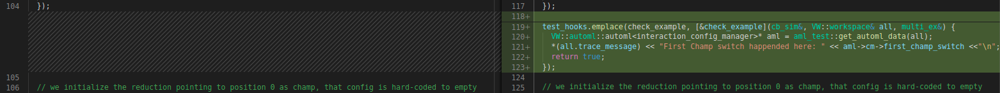
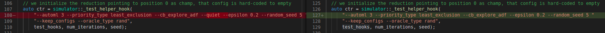

# Screening Exercise Submission: AutoML RLOS 2022

The readme describes the changes I did to complete the Screening exercise. And the repository contains the forked Vowpal Wabbit repository modified and the added snippets of code. The structure of the remainder of the README is as follows

- [Describing the Screening Exercise](#describing-the-screening-exercise)
- [Answer](#answer)
- [My Approach to solve it](#my-approach)
    - [X] [Brute Force approach](#brute-force)
    - [X] [Efficient approach](#efficient-approach)

The following screening exercise is for the project [AutoML Extentions](https://vowpalwabbit.org/rlos/2022/projects#automl-extensions) where are working on integrating the ChaCha based online automl algorithm for obtaining optimal learning configuration.

## Describing the Screening Exercise

The screen exercise can be found [here](https://vowpalwabbit.org/rlos/2022/projects#screening-exercise). It states that we must report the iteration when the first champion switch occurs for a new seed number 11. Such that with this reported value set for `deterministic_champ_switch`, the unit test in `automl_first_champ_switch` passes with no error. Another factor is to explain the approach and process to achieve the solution.

## Answer

<h3>The answer is 114.</h3> At iteration number 114 the champ switches for the first with seed 11. 

## My Approach

After a deeper look into the cb_sim it was clear that we had to use the test_hooks with lambda functions to infer any information from the learner/simulator. And that these hooks run at the iteration step as specified in the callback map. So further I needed to look into the [reductions/automl.cc](vowpalwabbit/reductions/automl.cc) to understand the variables and functions in the [`interaction_config_manager`](vowpalwabbit/reductions/automl.cc#L154). It was very evident that the [`one_step`](vowpalwabbit/reductions/automl.cc#L122) function runs at every iteration and after the first batch of interactions we have a function named [`update_champ`](vowpalwabbit/reductions/automl.cc#L407) that checks the `better`/`worse` configs and checks if the champions should be swapped with the Challenger config or not. If in case the a champion is swapped with a challenger config we increment the variable [`total_champ_switches`](vowpalwabbit/reductions/automl.cc#L485). For our exercise we have to monitor the variable `total_champ_switches` and the iteration number when it first changes. As Automl Extention is implemented along side a `base_learner` so all the information is computed and stored in config_manager. And all the functions and values are isolated from the base_learner and the config_manager.

Hence to get the iteration number I proposed using either of the two method.
- [X] [Brute Force](#brute-force): Callback based check on every iteration of the simulator, for the variable `total_champ_switches` in the config_manager from automl.
- [X] [Efficient Approach](#efficient-approach): For the callback we get the config_manager point and check rather this check can be put inside the `one_step`((vowpalwabbit/reductions/automl.cc#L122) function only if in case the update champ function is called. This reduces the number of times the check is run and also prevents from requesting and making local copy of the config_manager.

### Brute Force

For this approach we only require to define test_hook callback map with one lambda function that checks if the `total_champ_switches` is 1 for the first time.

[`test/unit_test/automl_test.cc`](test/unit_test/automl_test.cc#L80)

This would simply give a error message and print the iteration number when the first `total_champ_switches` is 1.

### Efficient Approach

The above approach fetches the `config_manager` and check the variable every iteration of the simulator. A better approach would be by modifiying the config manager to store another variable and modifying the `one_step` function to check if the champ is updated the first time this would reduce the number of checks and the information can be used at any time even after executing the whole batch of data.

[`vowpalwabbit/reductions/automl.h`](vowpalwabbit/reductions/automl.h#L103)

[`vowpalwabbit/reductions/automl.cc`](vowpalwabbit/reductions/automl.cc#L121)

With the above changes we can easily infer the required answer for any seed by querying the variable `first_champ_switch`

To print it I simply used 1 callback at large iteration number, I could have also just added a `debug_print(e)` inside the if statement, But I was not able to get the debug_print and debug_log working hence as this was not the main objective of the exercise I print the characters directly onto the osstream.

[`test/unit_test/automl_test.cc`](test/unit_test/automl_test.cc#L119)

And removed the quite tag, so that stream is printed on the console.

[`test/unit_test/automl_test.cc`](test/unit_test/automl_test.cc#L127)

